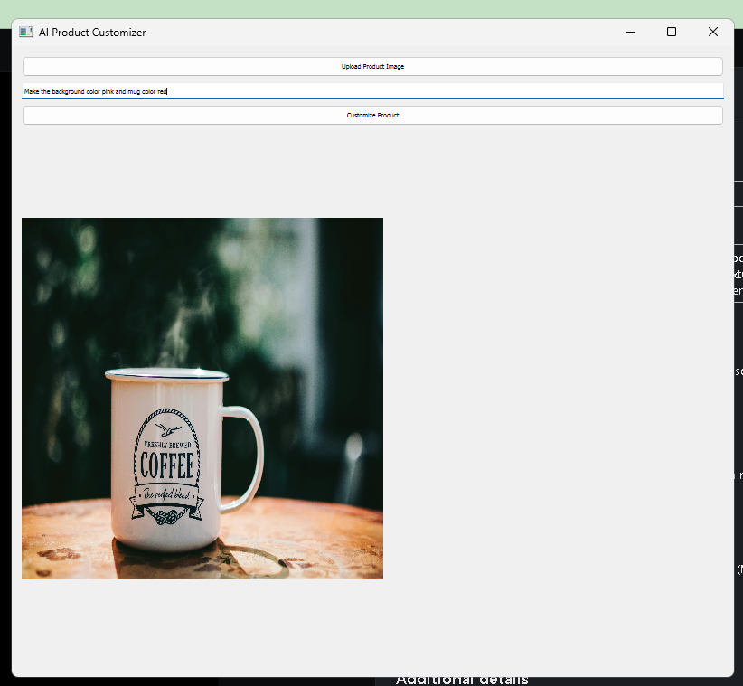

# AI Product Customizer

An **AI-powered tool** that allows users to upload product images, remove backgrounds, and generate personalized designs using text prompts with the help of **Stable Diffusion**.

---

## 📌 Features
- **Upload product images** via a clean and simple **PyQt5 GUI**
- **Background removal** using [`rembg`](https://github.com/danielgatis/rembg) for precise product isolation
- **AI customization** using **Stable Diffusion (img2img)** powered by **PyTorch**
- **Real-time previews** of customized products
- **Organized outputs** for previews and final designs
- **GPU acceleration** for faster processing (if available)

---
## 📸 Project Demo

<table>
<tr>
<td><b>🖥️ User Interface</b></td>
<td><b>📥 Input Product</b></td>
<td><b>📤 Output Design</b></td>
</tr>
<tr>
<td></td>
<td></td>
<td></td>
</tr>
</table>


---

## 🛠️ Tech Stack / Skills
**Python, PyQt5, PIL, Image Processing, rembg, Stable Diffusion, PyTorch, GUI Development, GPU Optimization, Product Customization**


## 📂 Project Structure
```


AI-Product-Customizer-project/
│
├── assets/                  # Images for README (UI, Input, Output)
├── data/                    # Sample input product images
├── outputs/                 # Generated previews and final designs
├── src/                     # Source code for the application
│   ├── app.py               # Main PyQt5 GUI application
│   ├── background\_remove.py # Background removal with rembg
│   ├── customize\_product.py # AI customization with Stable Diffusion
│   ├── utils.py             # Utility functions
│   └── **init**.py
├── requirements.txt         # Dependencies
└── README.md

```


## 🚀 Installation

1️⃣ **Clone the repository**
```bash
git clone https://github.com/<username>/AI-Product-Customizer-project.git
cd AI-Product-Customizer-project
````

2️⃣ **Create a virtual environment (optional but recommended)**

```bash
python -m venv venv
source venv/bin/activate   # On Linux/Mac
venv\Scripts\activate      # On Windows
```

3️⃣ **Install dependencies**

```bash
pip install -r requirements.txt
```

---

## ▶️ Usage

Run the application:

```bash
python src/app.py
```

**Steps:**

1. Upload a product image.
2. Enter a customization prompt.
3. Click **Customize Product**.
4. View the AI-generated preview and final design.

---

## 📜 License

This project is licensed under the **MIT License** – see the [LICENSE](LICENSE) file for details.

---

## 🤝 Contributing

Pull requests are welcome! If you find a bug or want to add features, please open an issue first to discuss your ideas.

---

## ⭐ Show Your Support

If you like this project, **give it a star** on GitHub!


